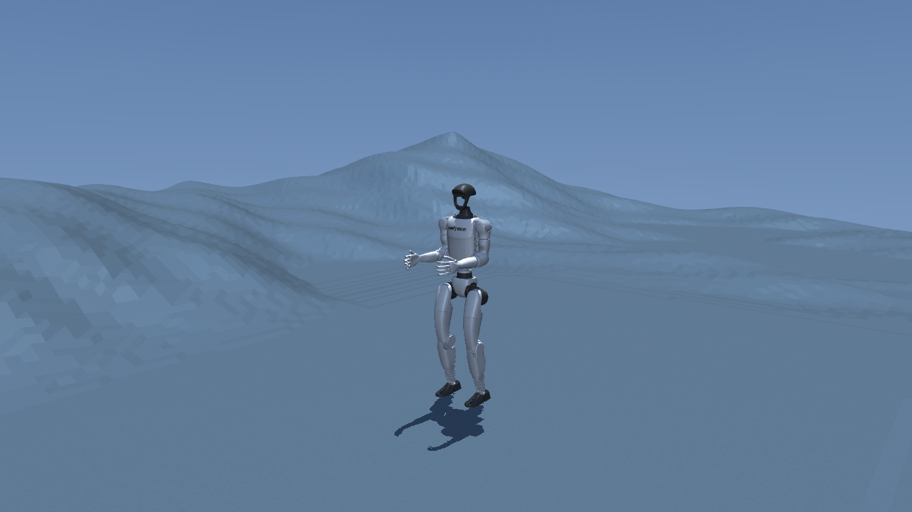

# Everest G1



Everest G1 is a simulation-first rescue vertical slice: a Unitree G1 approaches
a motionless adult lying in snow, stops at touching distance, and—only when the
operator explicitly arms it—asks BeaconCall to place one LiveKit/Twilio voice
call. In MuJoCo, the one-shot trigger also captures the G1's robot-relative
front camera. BeaconCall asks OpenAI for an observable description before the
call, appends it to the existing report, waits for an acknowledgment, and does
not diagnose the person.

The first commissioning controller runs in NVIDIA Isaac Lab-Arena at 50 Hz with
the G1 AGILE whole-body controller. The repository also pins NVIDIA's real
GR00T N1.7 + GEAR-SONIC workflow for dataset collection, fine-tuning, and later
whole-body policy evaluation. Those are distinct controllers and are never
presented as interchangeable.

## Sponsors

| Sponsor | Integration |
| --- | --- |
| **Bright Data** | Optional public-condition research through its hosted MCP, restricted to `search_engine` and `scrape_as_markdown`. Results are context only and cannot write motion commands. |
| **LiveKit** | BeaconCall dispatches an outbound LiveKit SIP call through Twilio after the simulation's one-shot proximity gate. The destination number stays on the BeaconCall server. |

NVIDIA Isaac Lab, Isaac Lab-Arena, Isaac-GR00T, GEAR-SONIC, and Isaac Teleop are
the robot simulation/control stack, not sponsor claims made by this repository.

## What works

- A committed snow scene, a detailed prone MuJoCo casualty, and a safe Isaac proxy.
- Optional conversion of a legally obtained FBX to a gitignored USD.
- A bounded approach command: 0.20 m/s forward, 0.12 m/s lateral, 0.30 rad/s yaw.
- A 0.15 m surface-distance threshold with a continuous 0.25 s dwell.
- Stop-on-proximity and exactly one call submission per simulator process.
- A non-blocking call worker: network latency never stalls the 50 Hz policy.
- Two-part live-call arming and redacted JSONL audit events.
- Isaac Lab-Arena on Brev for interactive work and Modal probes for headless jobs.
- Pinned GR00T N1.7/SONIC training lane using `UNITREE_G1_SONIC`.
- The same approach, stop, dwell, and BeaconCall flow in local MuJoCo on macOS.
- One bounded MuJoCo G1 front-camera JPEG, captured only after an armed proximity latch.

This repository does **not** claim a zero simulation-to-reality gap. It pins
software, bounds commands, logs measurements, and separates control from cloud
calls so the remaining gap can be measured. Physical G1 deployment is outside
this release gate.

## Architecture

```text
Bright Data (optional, async context only)
                  |
                  v
Isaac/MuJoCo scene -> bounded G1 policy -> proximity dwell -> robot stops
                                                     |
                                                     v one-shot worker
                                          BeaconCall API + camera JPEG
                                                     |
                                                     v
                                        OpenAI observable description
                                                     |
                                                     v
                                           LiveKit SIP -> Twilio
```

BeaconCall is a separate repository/service. Its server owns the destination
phone number and LiveKit/Twilio credentials; Everest G1 receives only an API URL
and Bearer token. See [the architecture](docs/ARCHITECTURE.md) for the complete
authority model.

## Local verification

The Isaac packages are Linux/GPU-only, but the complete MuJoCo rescue behavior,
safety trigger, and call gate run locally:

```bash
uv sync --extra dev
uv run everest-g1 dry-run
make verify
```

The dry run must finish with `"reached": true` and
`"live_call_armed": false`. It never places a call.

## MuJoCo on macOS: same rescue behavior

Run the G1, prone-person proxy, approach controller, stop, and dwell locally:

```bash
make mujoco-rescue
```

On macOS this launches MuJoCo through `mjpython`; on Linux it uses normal
Python. The default is disarmed. A fast non-visual acceptance run is:

```bash
make mujoco-rescue-headless
```

Its JSON must report `"rescue_reached": true`, `"falls": 0`, and
`"call_submitted": false`.

To exercise the real LiveKit/Twilio handoff, first run BeaconCall with its
server-side destination and credentials configured. Then arm both gates in a
fresh shell and launch MuJoCo:

```bash
export BEACON_API_URL=https://YOUR-BEACON-HOST
read -rsp 'Beacon API token: ' BEACON_API_TOKEN; export BEACON_API_TOKEN; echo
export EVEREST_ARM_LIVE_CALL=ARM-LIVE-CALL
uv run mjpython -m summit_sentinel --mode viewer --seconds 60 \
  --rescue --arm-live-call
```

MuJoCo submits the same authenticated `/api/incidents/outbound-call` request as
Isaac, plus one 640×480 JPEG from `g1_front_camera`. BeaconCall analyzes that
frame before dispatching LiveKit and adds the observable description to the
existing deterministic alert. The frame is not sent to LiveKit or Twilio. If
capture or analysis fails, the base proximity report still proceeds without
inventing visual facts. BeaconCall—not the simulator—owns the phone number,
OpenAI/LiveKit keys, Twilio SIP trunk, wording, acknowledgment wait, and hangup.
Unset the arming variables afterward.

## Brev: interactive Isaac Lab-Arena

Use an Ubuntu x86_64 Brev instance with an NVIDIA RTX-class GPU. Clone this
repository on the instance, then:

```bash
cd everest-g1
./cloud/brev_setup.sh
./cloud/run_brev_rescue.sh
```

The first command installs the pinned Arena environment at
`/home/ubuntu/workspace/everest-g1-cloud/IsaacLab-Arena`. The second opens the
viewer and runs a 60-second, disarmed rollout.

Only after BeaconCall is running and a disarmed rollout succeeds:

```bash
export BEACON_API_URL=https://YOUR-BEACON-HOST
read -rsp 'Beacon API token: ' BEACON_API_TOKEN; export BEACON_API_TOKEN; echo
./cloud/run_brev_rescue.sh --arm-live-call
```

The script then requires the exact typed phrase `ARM-LIVE-CALL`. It never asks
for or stores the destination phone number.

Full instructions: [Cloud runbook](docs/CLOUD_RUNBOOK.md).

## Modal: headless probe and evaluation

Do not paste Modal tokens into source files or commands committed to git. Log in
with Modal's normal CLI flow, accept NVIDIA's container EULA, then run:

```bash
python -m pip install 'modal>=1.1,<2'
modal run cloud/modal_app.py --steps 500
```

This first imports Isaac/Arena on an L40S. It starts the headless rescue only if
that probe passes. A failed Vulkan/Isaac probe is a hard result—not a reason to
weaken checks; use Brev as the supported interactive fallback.

The Modal file also defines `finetune_groot_n17_sonic` for the N1.7
`UNITREE_G1_SONIC` embodiment and `train_sonic_controller` for controller
training, both on H100 with named dataset/model volumes. They require an
`everest-huggingface` Modal Secret containing `HF_TOKEN`; no token is in source.

## GR00T N1.7 and GEAR-SONIC

The runnable rescue commissioning path uses Arena's AGILE G1 WBC. The later
learned path is NVIDIA's actual SONIC latent-action architecture:

```text
GR00T N1.7 at 2.5 Hz -> 64-dimensional SONIC tokens -> SONIC decoder at 50 Hz
```

Set up the pinned upstream checkout separately:

```bash
./cloud/setup_groot_sonic.sh
```

Do not install it into Arena's environment: the pinned Arena lane uses Isaac
Lab 3.0 beta, while the released SONIC lane uses Isaac Lab 2.3.2. Dataset
collection or a task-specific checkpoint is required before replacing the
scripted commissioning policy. See [GR00T + SONIC](docs/GROOT_SONIC.md).

## Person assets

The MuJoCo scene uses the committed Robot Nurse casualty OBJ and albedo. The
Isaac default `downed_person_proxy.usda` remains a conservative USD-primitives
proxy. If you have a different FBX with redistribution rights, convert it for
Isaac without adding the generated result to git:

```bash
mkdir -p runtime/isaac_assets
blender --background --python scripts/convert_person_fbx.py -- \
  /absolute/path/to/person.fbx runtime/isaac_assets/downed_person.usd
```

For a custom asset, invoke the underlying Arena command shown in the cloud
runbook. The wrapper accepts only its documented live-call flag. `.fbx` and
binary `.usd` files are ignored to prevent accidental redistribution.

## BeaconCall contract

Everest sends:

```http
POST /api/incidents/outbound-call
Authorization: Bearer <BEACON_API_TOKEN>
Idempotency-Key: everest-<simulation_id>
Content-Type: application/json

{
  "simulation_id": "opaque-run-id",
  "observed_state": "motionless_adult_in_snow",
  "distance_m": 0.12,
  "camera_name": "G1-FRONT-CAMERA",
  "image_data_url": "data:image/jpeg;base64,<one-bounded-frame>"
}
```

No phone number is present in the request, logs, or simulator configuration.
BeaconCall constructs a deterministic statement that this is a simulation,
states that responsiveness and vital signs are unknown, and—when the frame is
present—appends OpenAI's observable visual description before asking for an
acknowledgment. It then terminates the room.

## General MuJoCo controls

The locally runnable joystick and telemetry modes remain available:

```bash
make sim-headless
make sim
```

They are useful for controller/UI work without an NVIDIA GPU. The rescue mode
matches the scenario behavior and call contract, but passing MuJoCo still does
not replace the Isaac commissioning gate.

## Safety boundaries

- Live calls default off and fail closed.
- Bright Data, LiveKit, Twilio, SSH, and other network work is outside control loops.
- Web content is untrusted context, never a robot instruction.
- Proximity latches locally and motion becomes zero before call submission.
- One simulator process can enqueue at most one call.
- Audit logs omit tokens and destination numbers.
- No physical Orin/Jetson deployment is authorized by this repository.

See [SECURITY.md](SECURITY.md) before enabling any external service.

## Upstream pins

Exact upstream SHAs live in [cloud/pins.env](cloud/pins.env). Generated datasets,
checkpoints, converted human assets, runtime logs, and credentials are ignored.
Third-party licensing details are in [THIRD_PARTY_NOTICES.md](THIRD_PARTY_NOTICES.md).

## License

Project code is MIT licensed. Third-party assets and external model weights keep
their upstream terms.
